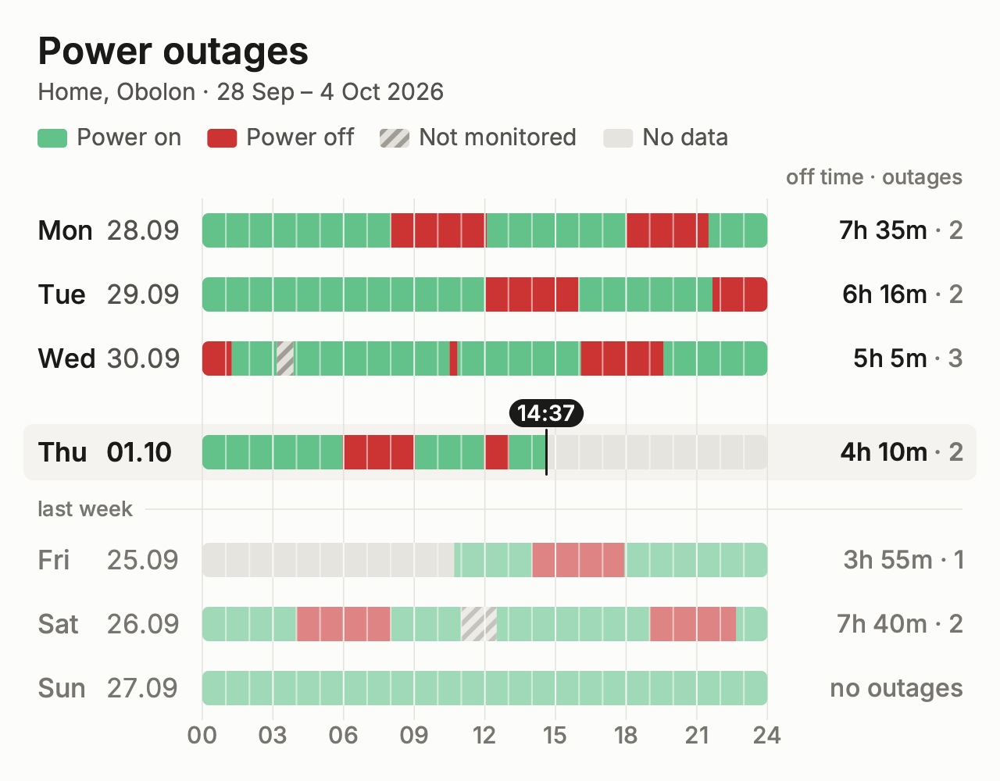
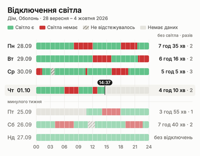

# Weekly Chart Spec

This spec covers requirements CHRT-01 to CHRT-08. It describes the image that is pinned in every
location's Telegram chat: seven day rows (Mon-Sun), each 24 h wide, with daily totals, a legend
and a "now" marker. There is one theme, a light one; a dark theme is deferred to v2 (CHRT-09, not in
this milestone). The spec does not assume any framework. A mock generator is in
`assets/mock_generator.py.txt` (Python source saved as .txt so GSD does not treat the new repo as an
existing codebase). It is a reference, not production code.

| English | Phone size (400 px wide, as Telegram shows it) |
|---|---|
|  |  |

The SVG sources are `assets/chart-mock-uk.svg` and `assets/chart-mock-en.svg`. `assets/chart-mock-en-cvd.png`
shows the colour-blindness check: normal vision, deuteranopia, protanopia and grayscale.

Sample week in the mocks: today is Thu 01.10 and the time is 14:37. The sample data includes scheduled
outages of 1-4 h on most days. Tue 21:40 to Wed 01:15 crosses midnight. Wed 10:30-10:50 is a 20-minute
outage. Wed 03:10-03:52 is server downtime and is drawn as not monitored. Fri to Sun are last week's
days, drawn dimmed. Monitoring started Fri 25.09 at 10:42 (no data before that). Sat 11:00-12:30 is
maintenance mode. Sun had no outages. The exact intervals are in section 10, "Sample week fixture".

## 1. What changed from the legacy chart

The legacy chart had a 1400x1040 canvas, monospace labels, hour ticks and labels under every row, and
red and green bars that differed only in hue. It had no legend, no totals and no now marker. The new
chart, in scope for this milestone, has:
- one shared hour axis with 3-hour gridlines
- a legend
- daily totals
- a highlighted today row with a now marker
- a separate "not monitored" state
- colours that colour-blind viewers can tell apart
- a canvas at Telegram's native width
- one bundled sans font (Inter)

## 2. Canvas

- **1280 x 1000 px PNG.** The height never changes, even when the layout leaves space unused.
  - Telegram keeps a 1280 px long-side version as a photo's standard size. At exactly 1280 px wide
    the text is not resampled. The legacy 1400 px image was scaled down, which softened its text.
  - The ratio is 1.28:1. On a phone the photo is about 400 px wide and 312 px tall, so Telegram does
    not crop or letterbox it.
  - Because the height is fixed, editing the message in place every 15 minutes never resizes the chat bubble.
- Send the chart as a **photo**, not as a document, so it shows inline. Telegram re-encodes photos
  as JPEG. For that reason: use no hairline thinner than 1.5 px, no text smaller than 27 px, and a
  solid background. Telegram shows the photo exactly as it is in both its light and dark themes. A light
  card on a dark chat looks fine.
- The surface is solid `surface` (#FCFCFB) and has no transparency.

## 3. Layout grid (px, origin top-left)

| Element | Geometry |
|---|---|
| Side padding | 48 left and right. The content spans x = 48..1232. |
| Title | baseline y = 82 |
| Subtitle | baseline y = 128 |
| Legend | baseline y = 186. Swatches 38x24, rx 5, top at y = 165. Label starts 12 px after its swatch. Items are 34 px apart. |
| Totals column header | right-aligned at x = 1232, baseline y = 236 |
| Plot top | y = 254 (top of the first row) |
| Row | pitch 82. Bar height 44, starting 19 px below the row top. Bar corner radius 8. |
| Label column | Weekday at x = 48. Date at x = 48 + (widest localized weekday) + 14. Column width = widest weekday + 14 + width of "00.00". Measure widths with the real font at 34 px SemiBold. |
| Bar x-range | `bar_x0` = 48 + label column + 24. `bar_x1` = 1232 − totals column − 24. Hours map linearly: x = bar_x0 + h/24 · (bar_x1 − bar_x0). |
| Totals column | Width of the widest of: "no outages" (localized), the worst-case total `23 h 59 m · 12`, and the column header, each measured. Right-aligned at x = 1232. |
| Extra space above today's row | +38 px, for the now pill |
| "Last week" divider | +56 px zone above the first dimmed row. The caption is centred at zone top + 32. A hairline runs from the caption's end + 16 to x = 1232. |
| Hour axis | labels on baseline = bottom of the last row's 82 px box + 30 |

Resulting bar x-range: uk and ru ≈ 232..953, en ≈ 259..982. Both are about 30 px per hour.
The tallest layout ends at y = 952, leaving 48 px of padding below. On Sundays there are no dimmed rows
and no divider, so the empty zone becomes extra bottom padding.

## 4. Typography

**Inter 4.1, static TTFs, weights Regular, Medium and SemiBold** (github.com/rsms/inter, SIL OFL 1.1).
Bundle the font files in the repo and point the renderer at them explicitly. Never depend on system fonts.
- Why Inter: it covers Ukrainian and Russian Cyrillic in full (ї є ґ і ё) and has hinting tuned
  for screen sizes. It is narrow enough for "7 год 35 хв · 2" to fit a compact column. It is widely
  used, so it looks familiar.
- Fallback, only if a renderer cannot load Inter: Noto Sans (OFL). It is wider, so re-check the
  column widths.

| Text | Size | Weight | Colour |
|---|---|---|---|
| Title | 48 | SemiBold | ink-primary |
| Subtitle | 30 | Regular | ink-secondary |
| Legend labels | 30 | Regular | ink-secondary |
| Row weekday | 34 | Medium (today: SemiBold) | ink-primary (dimmed rows: ink-muted) |
| Row date | 34 | Regular (today: SemiBold) | ink-secondary (today: ink-primary; dimmed rows: ink-muted) |
| Daily total | 32 | Medium (today: SemiBold) | ink-primary. The " · N" part is ink-muted. Dimmed rows: all ink-muted. |
| Totals header, divider caption | 27 | Medium | ink-muted |
| Hour axis labels | 30 | Medium | ink-muted |
| Now pill | 28 | SemiBold | surface on ink-primary |

Vertically centre the text on its bar: baseline = bar centre + 0.36 × font size.
On a 400 px wide phone, the smallest text (27 px) shows at about 8.4 px, and the row labels at about 10.6 px.

## 5. Colour tokens

| Token | Hex | Use |
|---|---|---|
| surface | `#FCFCFB` | canvas |
| ink-primary | `#1A1A19` | title, current-week labels and totals, now line and pill (17:1 on surface) |
| ink-secondary | `#52514E` | subtitle, legend, dates, "no outages" (7.7:1) |
| ink-muted | `#777570` | axis, headers, divider caption, the " · N" count, dimmed rows' text (4.5:1) |
| grid | `#E3E2DC` | 3-hour gridlines and the divider hairline, 1.5 px |
| today-band | `#F4F3EF` | today row highlight |
| on | `#62C28A` | power on |
| off | `#CC3434` | power off |
| no-data | `#E5E4DE` | empty track: before monitoring started, and the future |
| not-monitored base / stripe | `#E2E0DA` / `#A09D94` | maintenance and server downtime (hatched) |
| on-dim / off-dim | `#A0D9B7` / `#DF8484` | previous-week rows |
| not-monitored-dim base / stripe | `#ECEBE7` / `#C5C3BD` | previous-week rows |
| no-data-dim | `#E5E4DE` | same as no-data |

- **Dimmed colours** are 60% of the colour mixed with 40% surface. Compute them this way. Do not use
  opacity, because the today band and gridlines behind the bar would show through.
- **Not-monitored pattern:** stripes at 45°, repeating every 14 px, each stripe 6 px wide. Anchor the
  pattern to the canvas, not to each segment, so the stripes line up across rows.
- **Colour-blind safety:** red and green stay, because they match the 🔴/🟢 alert emoji. Separation
  does not depend on hue. ON is light (OKLCH L 0.74) and OFF is dark (L 0.56), so the two differ in
  grayscale too.
  - Measured difference (OKLab ΔE ×100), shown as normal / protanopia / deuteranopia:
    - on vs off: 33.7 / 31.0 / 17.4
    - on-dim vs off-dim: 21.7 / 19.8 / 12.1
    - Target is ≥ 8.
  - Contrast against the surface is 4.98:1 for OFF and 2.13:1 for ON. ON is a large fill, and its
    meaning also comes from the legend and the totals text.
  - The dimmed set is deliberately below the chroma floor, because its job is de-emphasis.
  - If anyone changes these colours: keep ON at least 0.15 L lighter than OFF, and re-run a CVD check.
- **No-data vs not-monitored** differ by pattern, not by colour.

## 6. Marks

- **Track:** each day row is a 44 px bar with rounded ends (radius 8), filled `no-data`. Segments are
  clipped to the track shape. Segments have square ends inside the bar and never have outlines.
- **Segments:** one rectangle per state interval, drawn from its start x to its end x. Draw order is
  on, then not monitored, then off, so OFF is always on top.
- **Minimum OFF width is 8 px** (about 16 min). A shorter OFF interval is widened around its midpoint
  and shifted inward so it stays inside the bar. The daily total still shows the exact time.
  Other states have no minimum width.
- **Hour cells:** a 2 px surface-coloured separator at every hour, drawn over the segments. Opacity is
  90% at multiples of 3 h and 55% otherwise. This matches the hourly grids people know from outage schedules.
- **Gridlines:** at 00, 03, … 24. They are 1.5 px `grid` and run from the plot top to the bottom of
  the last row's 82 px box. They are drawn above the today band and below the bars.

## 7. Legend, axis, today, previous week

- **Legend** (one row, fixed order): on, off, not monitored (hatched swatch), no data. There are always
  four items, even when a state is absent this week.
- **Hour axis:** labels "00 03 06 09 12 15 18 21 24", centred on the gridlines, in 24-h format in all
  languages. There is one axis at the bottom only; the gridlines connect it to every row.
- **Today row:**
  - The `today-band` rectangle spans x = 30..1250, from bar top −14 to bar bottom +14, radius 12.
  - The weekday and date are SemiBold, and so is the total.
  - Segments run only up to *now*. After *now* the track stays empty (`no-data`).
- **Now marker:**
  - Line: 3 px `ink-primary`, from bar top −8 to bar bottom +8, at x(now).
  - Pill: 36 px high, fully rounded, horizontal padding 11 px. Its bottom edge is 2 px above the
    line's top. It shows `HH:MM` local time.
  - The pill is centred on the line but clamped to [bar_x0 − 8, bar_x1 + 8].
  - The pill time is the render time, so it also works as the "last updated" time inside the image.
- **Previous-week rows:**
  - Rows after today show the same weekday of the previous week: date = shown date − 7 days.
  - They use the dimmed colours and ink-muted text, and show their real dates (e.g. "Пт 25.09").
  - A divider captioned "минулого тижня / last week / прошлой недели" separates them from the current week.
  - On Monday there are 6 dimmed rows. On Sunday there are none and no divider.
- **Finished-day render:** at midnight, the previous day's message gets one final render with
  now = end of that day. That render has no now line and no pill; the today band stays.

## 8. Text formats per language

| Key | uk | en | ru |
|---|---|---|---|
| Title | Відключення світла | Power outages | Отключения света |
| Subtitle | `{name} · 28 вересня – 4 жовтня 2026` | `{name} · 28 Sep – 4 Oct 2026` | `{name} · 28 сентября – 4 октября 2026` |
| Weekdays | Пн Вт Ср Чт Пт Сб Нд | Mon Tue Wed Thu Fri Sat Sun | Пн Вт Ср Чт Пт Сб Вс |
| Row date | `DD.MM` | `DD.MM` | `DD.MM` |
| Legend | Світло є · Світла немає · Не відстежувалось · Немає даних | Power on · Power off · Not monitored · No data | Свет есть · Света нет · Не отслеживалось · Нет данных |
| Totals header | без світла · разів | off time · outages | без света · раз |
| Divider | минулого тижня | last week | прошлой недели |
| Duration (totals, caption) | `3 год 20 хв`, `4 год`, `45 хв`, `<1 хв` | `3h 20m`, `4h`, `45m`, `<1m` | `3 ч 20 мин`, `4 ч`, `45 мин`, `<1 мин` |
| Duration units (day / hour / min / sec) | `д` / `год` / `хв` / `с` | `d` / `h` / `m` / `s` | `д` / `ч` / `мин` / `с` |
| Zero outages | без відключень | no outages | без отключений |

- **Durations** (one formatter for row totals, the caption and the Telegram alerts):
  - A space goes between number and unit in uk and ru (`3 год 20 хв`), none in en (`3h 20m`). Parts are separated by one space.
  - Zero parts are left out (`4 год`, not `4 год 0 хв`).
  - Row totals and the caption show hours and minutes only, with minutes rounded half up. Some OFF time that rounds to 0 minutes shows `<1 хв` / `<1m` / `<1 мин`. They never use a day unit (a 25 h day that was off throughout shows `25 год`).
  - Alerts (PROJECT-BRIEF section 3): below 1 min, seconds (`45 с`, `45s`); from 1 min to 1 h, minutes and seconds (`12 хв 5 с`, `12m 5s`); from 1 h to 24 h, hours and minutes (`5 год 12 хв`, `5h 12m`); from 24 h, days, hours and minutes (`1 д 5 год`, `1d 5h`). Values are rounded half up to the smallest unit shown; if rounding reaches the next band, that band is used (59 min 59.6 s → `1 год`).
  - The day abbreviation `д` may be refined in planning; everything else here is fixed.
- **Subtitle:**
  - Month names are in the genitive for uk and ru, and abbreviated for en.
  - The year is printed once, at the end. If the week spans two years, print it on both dates.
  - If the location has no name, drop `{name} · `.
  - If the subtitle is wider than 1184 px, truncate the name with "…".
  - The location name is the only user-typed text in the image. Escape it for the renderer's markup (e.g. XML/SVG) before measuring and truncating it.
- **Daily total** is `{duration} · {count}`. Rules:
  - `off_seconds` = the real elapsed time of OFF intervals within the local day, up to *now* for today.
  - Minutes = round half up of `off_seconds / 60`. Show hours and minutes, and leave out a zero part.
    If there is some OFF time but it rounds to 0 minutes, show `<1 хв` / `<1m` / `<1 мин`.
  - Count = the number of outages that overlap the day. OFF intervals separated only by not-monitored
    time are one outage (an outage that spans server downtime or maintenance, see
    `docs/v1-lessons.md` INV-11). An outage that crosses midnight counts on both days, and an ongoing
    outage counts.
  - Not-monitored time is never OFF time.
  - If the day has on or off time but no OFF interval, show the "zero outages" text in ink-secondary.
  - If the day has no on or off time at all (only no data and/or not monitored), show "—" in ink-muted.
- **Caption (CHRT-04)** is plain text under the photo. Line 2 is the render time in local time:

| | uk | en | ru |
|---|---|---|---|
| Outages | `Сьогодні без світла: 4 год 10 хв · 2 відключення` | `Today off: 4h 10m · 2 outages` | `Сегодня без света: 4 ч 10 мин · 2 отключения` |
| None | `Сьогодні відключень не було` | `No outages today` | `Сегодня отключений не было` |
| Line 2 | `Оновлено о 14:37` | `Updated 14:37` | `Обновлено в 14:37` |

  - Plural forms follow CLDR rules:
    - uk: 1, 21 відключення (one); 2-4, 22 відключення (few); 5-20, 25 відключень (many).
    - ru: отключение / отключения / отключений.
    - en: outage / outages.
  - On the finished-day render, replace "Сьогодні" / "Today" / "Сегодня" with the weekday and date
    (`Чт 01.10`, `Thu 01.10`).

## 9. Data semantics

- **Input:** the chart is a pure function of (stored power timeline for the location, now, display
  time zone, language, location name). It returns PNG bytes. It never reads raw heartbeats and never
  derives state from heartbeat gaps (decision KD1). The same inputs, font files and renderer version
  must produce the same image.
- **States:**
  - `on` and `off` come from the engine's intervals. An OFF interval starts at the last heartbeat, the
    same instant the alert uses.
  - `not monitored` means maintenance mode or server downtime.
  - Any time the timeline does not cover is **no data**: before the location's first heartbeat, after
    a history reset, and the future.
  - The open (current) interval is drawn up to *now*.
- **Time zone:** store instants in UTC and convert them to local time (default Europe/Kyiv) with the
  IANA tz database. Never hard-code offsets. Ukraine may drop DST, and tzdata handles that.
- **Day slicing:** a day row covers the instants from local midnight to the next local midnight,
  including its start and excluding its end. Clip each interval to that range. An outage that crosses
  midnight appears at the end of one row and the start of the next.
- **x-position:** position by local wall-clock time. The axis is always 00-24.
  - **Spring-forward day** (last Sunday of March, 03:00→04:00): the 03:00-04:00 slot does not exist.
    Draw it as no data.
  - **Fall-back day** (last Sunday of October, 04:00→03:00): 03:00-04:00 happens twice. Draw only the
    later occurrence, by dropping the first occurrence (fold = 0) before drawing.
  - Totals and captions always use real elapsed time, so the 23 h and 25 h days are counted correctly.
- **Now marker** uses local wall-clock *now*. Nothing is drawn to the right of it in today's row.
- **Changing a location's thresholds** never changes the chart for past days (DATA-04), because the
  chart reads stored intervals only.

## 10. Acceptance checklist

Interval-level tests (unit, no image):
- [ ] An interval crossing midnight is split exactly at local midnight, and each part is on the right day.
- [ ] Spring-forward day: the 23 h day renders with a no-data 03:00-04:00 slot, and totals use real time.
- [ ] Fall-back day: the repeated hour shows the later occurrence, and totals include both occurrences.
- [ ] Totals formatting, for each language:
  - 0 s → zero-outages text
  - 29 s → `<1 хв`
  - 30 s → `1 хв`
  - 59 min 30 s → `1 год`
  - 3 h 20 min
  - exactly 4 h → `4 год`
- [ ] Count: a cross-midnight outage counts on both days, an ongoing outage counts, not-monitored time never counts, and an outage split by a not-monitored span counts once.
- [ ] Row mapping:
  - today = Thu: Fri-Sun show dates −7 days and are dimmed
  - today = Mon: 6 dimmed rows
  - today = Sun: no dimmed rows and no divider
- [ ] Nothing is drawn after *now*, and the open interval ends at *now*.
- [ ] An OFF interval under 8 px is drawn 8 px wide and stays inside the bar, including at 00:00 and 24:00.
- [ ] Caption plural forms are correct for n = 1, 2, 5, 11, 21, 22 in uk and ru, and the finished-day caption uses the date.
- [ ] Every character in every localized string (plus digits, "·", "–", "—", "<") is in the bundled
      font's cmap, so no tofu boxes.

Image-level tests:
- [ ] The output is exactly 1280x1000 PNG with an opaque background.
- [ ] Golden images: once the rendered sample week (below; uk and en) has been approved by eye against
      the mocks, commit the renderer's own output as goldens and compare later renders to those, with a
      small tolerance (e.g. ≤ 0.5% of pixels differing by more than 8/255, because font rasterization
      differs across library versions). Regenerate the goldens only on purpose. The mocks are the
      visual target, not pixel references: the implementation does not have to match them pixel for pixel.

Manual check, once per design change:
- [ ] (manual) The layout, colours, labels and states visibly match the mocks in this document.
- [ ] View the image at 400 px wide and check that every label is readable.
- [ ] Run a CVD simulation.
- [ ] Post it to a test channel and view it in Telegram's light and dark themes.

### Sample week fixture

The mocks and the golden images render exactly this data. Times are local Europe/Kyiv (UTC+03:00 on
all these dates, so there is no DST day in it). *now* = Thu 2026-10-01 14:37. Location name
"Дім, Оболонь" (uk), "Home, Obolon" (en), "Дом, Оболонь" (ru). Anything not covered by an interval is
no data. The same data is `TIMELINE` in `assets/mock_generator.py.txt`.

| # | State | Start | End | Note |
|---|---|---|---|---|
| 1 | on | 2026-09-25 10:42 | 2026-09-25 14:00 | monitoring starts |
| 2 | off | 2026-09-25 14:00 | 2026-09-25 17:55 | |
| 3 | on | 2026-09-25 17:55 | 2026-09-26 04:00 | |
| 4 | off | 2026-09-26 04:00 | 2026-09-26 08:00 | |
| 5 | on | 2026-09-26 08:00 | 2026-09-26 11:00 | |
| 6 | not monitored | 2026-09-26 11:00 | 2026-09-26 12:30 | maintenance |
| 7 | on | 2026-09-26 12:30 | 2026-09-26 19:00 | |
| 8 | off | 2026-09-26 19:00 | 2026-09-26 22:40 | |
| 9 | on | 2026-09-26 22:40 | 2026-09-28 08:00 | Sun: no outages |
| 10 | off | 2026-09-28 08:00 | 2026-09-28 12:05 | |
| 11 | on | 2026-09-28 12:05 | 2026-09-28 18:00 | |
| 12 | off | 2026-09-28 18:00 | 2026-09-28 21:30 | |
| 13 | on | 2026-09-28 21:30 | 2026-09-29 12:02 | |
| 14 | off | 2026-09-29 12:02 | 2026-09-29 15:58 | |
| 15 | on | 2026-09-29 15:58 | 2026-09-29 21:40 | |
| 16 | off | 2026-09-29 21:40 | 2026-09-30 01:15 | crosses midnight |
| 17 | on | 2026-09-30 01:15 | 2026-09-30 03:10 | |
| 18 | not monitored | 2026-09-30 03:10 | 2026-09-30 03:52 | server downtime |
| 19 | on | 2026-09-30 03:52 | 2026-09-30 10:30 | |
| 20 | off | 2026-09-30 10:30 | 2026-09-30 10:50 | 20-min outage |
| 21 | on | 2026-09-30 10:50 | 2026-09-30 16:05 | |
| 22 | off | 2026-09-30 16:05 | 2026-09-30 19:35 | |
| 23 | on | 2026-09-30 19:35 | 2026-10-01 05:57 | |
| 24 | off | 2026-10-01 05:57 | 2026-10-01 09:03 | |
| 25 | on | 2026-10-01 09:03 | 2026-10-01 11:58 | |
| 26 | off | 2026-10-01 11:58 | 2026-10-01 13:02 | |
| 27 | on | 2026-10-01 13:02 | (open) | drawn up to *now* |

Expected row totals: Mon `7h 35m · 2`, Tue `6h 16m · 2`, Wed `5h 5m · 3`, Thu `4h 10m · 2`,
Fri 25.09 `3h 55m · 1`, Sat 26.09 `7h 40m · 2`, Sun 27.09 `no outages`.
